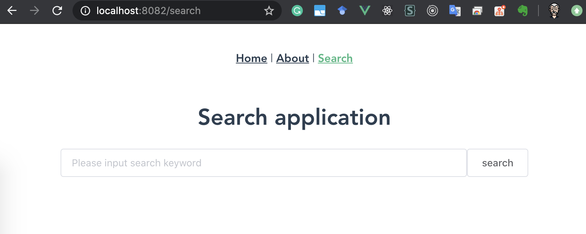
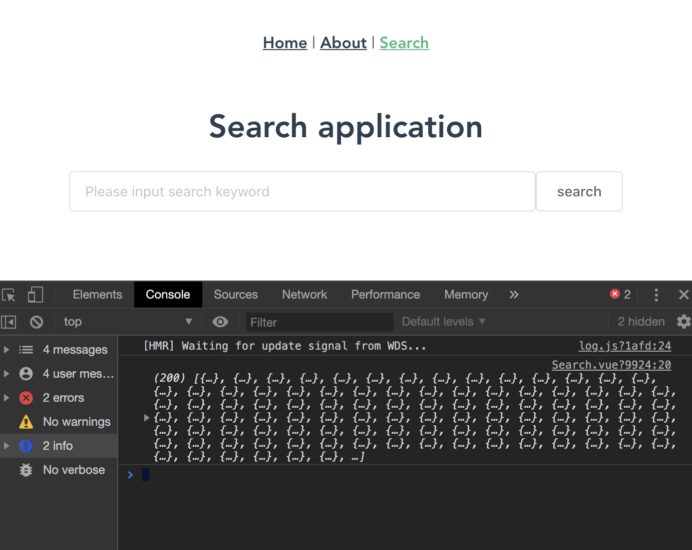
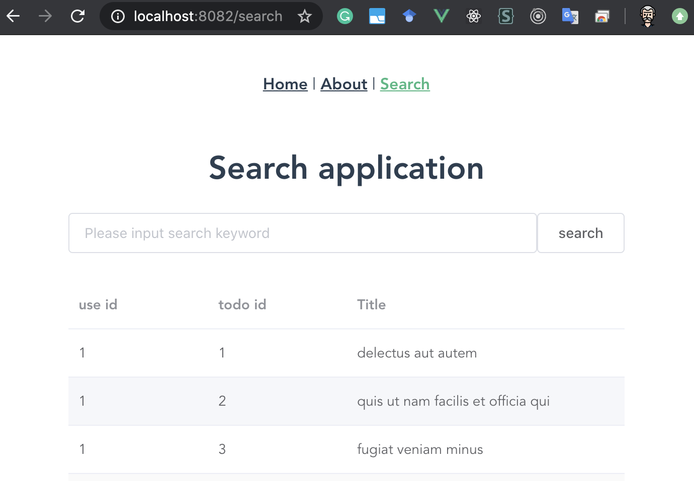
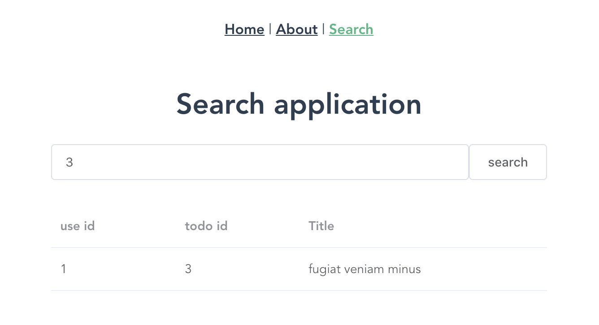

<!-- size: 16:9 -->

<style>
    @font-face
    {
        font-family: monaco;
        src: url('./assets/fonts/monaco.ttf')
    }
    section {
        background:#1CAF7A;
        color:#FFFFFF;
        font-family: 'monaco' 'Monaco';
        justify-content: flex-start;
    }
    h1 {
        position: relative;
        color: #2B4052;
    }
    h2 {
        margin-top: 0;
    }
    h5 {
        background: #2B4052;
        color: #FFFFFF;
        text-align: center;
        padding: 5px 0px 5px 0px;
        width: 40%;
    }
    p{ color:#FFFFFF;}
    li {list-style-type: none;}
    li:before {
        content: '';
        width: 6px;
        height: 6px;
        display: inline-block;
        border-radius: 100%;
        background: #FFFFFF;
        position: relative;
        left: -15px;
        top: -5px;
    }
    table {padding: inherit;}
    th {
        background: #D5EBDC;
        color: #2A2B25;
        font-size: 18px;
    }
    td{color: #2A2B25; font-size: 14px;}
    pre {color: #25373D;font-size: 18px;}
    footer {color: #D6D6D6;}

</style>

<style scoped>
    section {
        justify-content: center;
    }
    p{
        text-align: right;
        margin-top: 10%;
        font-size: 18px;
    }
</style>

# Vue.js Hands on

- 目次
    - Vue.jsとは
    - apiにブラウザからrequestを送る
    - responseをブラウザに表示する
    - いい感じにきれいにする

---

# 事前準備

## for mac

- nodeのinstall
```
brew update
brew install node
```

- vue/cliのinstall
```
npm install -g @vue/cli
```
- vue createしたあと
```
npm install --save element-ui
npm install --save axios
```


---

# Vue.jsとは

### 概要:older_man:
- 2014年にリリースされた、JavaScriptのフレームワーク
    - [Vue.js公式サイト](https://jp.vuejs.org)
    - JavaScriptのフレームワークは他にも(React, AngularJS, jQuery...)
    - Adobeとか任天堂とかでも採用されてるらしい
### Vue.jsのいいところ
- 公式Documentがちゃんとしてる(公式ページ一通りやると、いい感じに学べる)

---

<style scoped>
    h1 {
        text-align: center;
        font-size: 70px;
        /* height: 100%; */
        padding-top: 5%;
    },
    li {
        padding-top: 2%;
        padding-left: 25%;
    }
</style>

# やってみましょう :older_man:

1. :one: Vueプロジェクトを作成
2. :two: 新しいComponentを作成
3. :three: apiを呼んでみる
4. :four: inputを反映してapiを呼んでみる

---

<style scoped>
    h1 {
        text-align: center;
        font-size: 70px;
        /* height: 100%; */
        padding-top: 5%;
    },
    li {
        padding-top: 2%;
        padding-left: 25%;
    }
</style>

# やってみましょう :older_man:

1. :one: Vueプロジェクトを作成

---

# Vueプロジェクトを作成

- 好きなdirectoryを作って、そこでプロジェクト開始
- terminal
```
$ mkdir sample-vue-project
$ vue create <folder-name> // <folder-name>がheaderとかになるよ
```

- 必要に応じて設定を選ぶ


---

```
Vue CLI v3.0.1
? Please pick a preset: Manually select features
? Check the features needed for your project: 
 ◉ Babel
 ◯ TypeScript
 ◯ Progressive Web App (PWA) Support
 ◉ Router
 ◉ Vuex
 ◉ CSS Pre-processors
 ◉ Linter / Formatter
❯◯ Unit Testing
 ◯ E2E Testing

 Vue CLI v3.0.1
? Please pick a preset: Manually select features
? Check the features needed for your project: Babel, Router, Vuex, CSS Pre-proce
ssors, Linter
? Use history mode for router? (Requires proper server setup for index fallback 
in production) Yes
? Pick a CSS pre-processor (PostCSS, Autoprefixer and CSS Modules are supported 
by default): SCSS/SASS
? Pick a linter / formatter config: Basic
? Pick additional lint features: Lint on save
? Where do you prefer placing config for Babel, PostCSS, ESLint, etc.? In packag
e.json
? Save this as a preset for future projects? No
```

---

# Vueプロジェクトを作成

- 設定を選び終えると、必要なpackageとかをvue/cliが準備してくれます
```
Vue CLI v4.3.1
✨  Creating project in /Users/sasakikensuke/marp-next/vue-handson/sample-prj/client.
⚙️  Installing CLI plugins. This might take a while...
///
```

- 完了したらこんな感じになる
```
[4/4] 🔨  Building fresh packages...
success Saved lockfile.

 $ cd <foldername> 
 $ yarn serve
```

---

# Vueプロジェクトを作成

- お試しserverを起動してみる
```
$ cd <foldername> 
$ yarn serve
```

- `localhost:8080/` にサンプルページが立ち上がれば作成成功

---

<style scoped>
    h1 {
        text-align: center;
        font-size: 70px;
        /* height: 100%; */
        padding-top: 5%;
    },
    li {
        padding-top: 2%;
        padding-left: 25%;
    }
</style>

# やってみましょう :older_man:

1. :one: Vueプロジェクトを作成
2. :two: 新しいComponentを作成

---

# 新しいComponentを作成

- 見た目をいい感じにするためのpackageを追加する [ElementUI](https://element.eleme.io/#/en-US/component/installation)

```
$ npm install --save element-ui
```

---

# 新しいComponentを作成

#### :one: routingを追加する
- router/index.js

```js
Vue.use(VueRouter)

const routes = [
    //
    {
        path: '/search',
        name: 'Search',
        component: () => import(/* webpackChunkName: "about" */ '../views/Search.vue')
    },
]
```

---

# 新しいComponentを作成

#### :two: viewを追加する
- views/Search.vue

```js
<template>
    <div id="search" style="width:80%; margin:auto;">
        <h1>Search application</h1>
    </div>
</template>
```

---

# 新しいComponentを作成

#### :three: formとbuttonを追加する
- views/Search.vue
```js
<template>
    <div id="search" style="width:80%; margin:auto;">
        <h1>Search application</h1>
        <div id="form-div" style="display:inline-flex; width:100%;">
            <el-input placeholder="Please input search keyword" v-model="input"></el-input>
            <el-button>search</el-button>
        </div>
    </div>
</template>

```

---

# 新しいComponentを作成

#### :three: formとbuttonを追加する (こんなかんじ)




---

<style scoped>
    h1 {
        text-align: center;
        font-size: 70px;
        /* height: 100%; */
        padding-top: 5%;
    },
    li {
        padding-top: 2%;
        padding-left: 25%;
    }
</style>

# やってみましょう :older_man:

1. :one: Vueプロジェクトを作成
2. :two: 新しいComponentを作成
3. :three: apiを呼んでみる

---

<style scoped>
    pre {
        font-size: 16px;
    }
</style>

# apiを呼んでみる

#### :one: methodを定義
- views/Search.vue
```js
<template>
    //
</template>

<script>

import axios from 'axios'

export default {
    methods: {
        getAllTodos() {
            axios.get("https://jsonplaceholder.typicode.com/todos/")
                .then(response => {
                    this.todos = response.data
                    console.log(this.todos)
                })
        }
    }
}
</script>
```

---

<style scoped>
    pre {
        font-size: 18px;
    }
</style>

# apiを呼んでみる

#### :two: dataを定義
- views/Search.vue
```js
<script>
export default {
    methods: {
        getAllTodos() {
            //
        }
    },
    data() {
        return {
            todos: [], // responseを格納する配列を定義
        }
    }
}
</script>
```

---

<style scoped>
    pre {
        font-size: 18px;
    }
</style>

# apiを呼んでみる

#### :three: methodとbuttonのclickイベントを紐づける
- views/Search.vue
```js
<template>
    <div id="search" style="width:80%; margin:auto;">
        <h1>Search application</h1>
        <div id="form-div" style="display:inline-flex; width:100%;">
            <el-input placeholder="Please input search keyword" v-model="input"></el-input>
            <el-button @click="getAllTodos">search</el-button>
        </div>
    </div>
</template>
```


---

<style scoped>
    h5 {
        margin: auto;
    }
</style>

# apiを呼んでみる

#### :four: ブラウザでconsoleを確認 → todosが呼べていることを確認

##### 

---

<style scoped>
    pre {
        font-size: 18px;
    }
</style>

# apiを呼んでみる

#### :five: responseをtable形式で表示する
- ElementUI → Component → table から
- views/Search.vue
```js
<template>
    <div id="search" style="width:80%; margin:auto;">
        <h1>Search application</h1>
        <div id="form-div" style="display:inline-flex; width:100%;">
            <el-input placeholder="Please input search keyword" v-model="input"></el-input>
            <el-button @click="getAllTodos">search</el-button>
        </div>

        <el-table :data="todos" stripe style="width: 100%; margin-top: 5%;">
            <el-table-column prop="userId" label="use id" :min-width="25"></el-table-column>
            <el-table-column prop="id" label="todo id" :min-width="25"></el-table-column>
            <el-table-column prop="title" label="Title" :min-width="50"></el-table-column>
        </el-table>
    </div>
</template>
```

---

<style scoped>
    h5 {
        margin: auto;
    }
</style>

# apiを呼んでみる

#### :six: ブラウザで表示確認 → tableにtodoの内容が表示できている

##### 

---

<style scoped>
    h1 {
        text-align: center;
        font-size: 70px;
        /* height: 100%; */
        padding-top: 5%;
    },
    li {
        padding-top: 2%;
        padding-left: 25%;
    }
</style>

# やってみましょう :older_man:

1. :one: Vueプロジェクトを作成
2. :two: 新しいComponentを作成
3. :three: apiを呼んでみる
4. :four: inputを反映してapiを呼んでみる

---

# inputを反映してapiを呼んでみる

#### :one: ページが読まれた時点で`getAllTodos()`が呼び出されるようにする
- views/Search.vue
```js

<script>
import axios from 'axios'

export default {
    methods: {
        //
    },
    data() {
        //
    },
    created() {
        this.getAllTodos()
    }
}
</script>
```

---

# inputを反映してapiを呼んでみる

#### :two: formのinputを反映して`getByID()`を実行する
- views/Search.vue
```js

<script>
export default {
    methods: {
        getById: function(input){
            const endpoint = "https://jsonplaceholder.typicode.com/todos/" + input
            axios.get(endpoint)
                .then(response => {
                    this.todos = [response.data]
                })
        },
        //
    }
}
</script>
```


---

# inputを反映してapiを呼んでみる

#### :three: dataにinputのテキストを追加
- views/Search.vue
```js

<script>
export default {
    methods: {
        //
    },
    data() {
        return {
            todos: [], // responseを格納する配列を定義
            input: '',
        }
    }
}
</script>
```

---

# inputを反映してapiを呼んでみる

#### :four: @clickに紐づいているmethodを更新
- views/Search.vue
```js

<template>
    <div id="search" style="width:80%; margin:auto;">
        <h1>Search application</h1>
        <div id="form-div" style="display:inline-flex; width:100%;">
            <el-input placeholder="Please input search keyword" v-model="input"></el-input>
            <el-button @click="getById(input)">search</el-button>
        </div>
    </div>
</template>
```
---

<style scoped>
    h5 {
        margin: auto;
    }
</style>

# inputを反映してapiを呼んでみる

#### :five: idを入力して1件だけ帰ってくることを確認

##### 


---


<style scoped>
    h1 {
        text-align: center;
        font-size: 70px;
        /* height: 100%; */
        padding-top: 5%;
    },
    li {
        padding-top: 1%;
        padding-left: 25%;
    }
</style>

# おつかれさまでした :100:

1. :one: Vueプロジェクトを作成
2. :two: 新しいComponentを作成
3. :three: apiを呼んでみる
4. :four: inputを反映してapiを呼んでみる

---

# ソースコード

- []()
    - :arrow_up: の題名ごとにcommitしているので、途中経過を追ってくdさい

---

# 参考

### export defaultの中身

```js
export default {
    methods: {
        // apiにリクエストするとかのmethodを書く
    },
    data() {
        // viewsの中で使いたいdataを書く
    },
    created() {
        // ライフサイクルフック
        // 要素が生成した時に最初にやりたい処理を書く
    },
}
```
